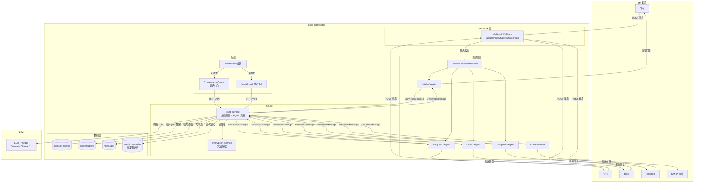

# DESIGN: Agent 多渠道 IM/邮箱对话接入

- **Change ID**: agent-channel-dialogue
- **关联**: `@.specs/agent-channel-dialogue/REQUIREMENT.md`、`@.specs/CONTEXT.md`
- **作者**: AI（Architect 角色）+ 人工 review

---

## 0. 技术栈选定

> 已有项目，技术栈已在 CONTEXT.md 锁定。不做变更。

- **选定**：沿用现有（React 18 + FastAPI + SQLAlchemy + SQLite/MySQL）
- **前端**：React 18.3 + TypeScript 5.5 + Vite 5.4 + Tailwind CSS 3.4 + Zustand 4.5 + Lucide React
- **后端**：FastAPI 0.110+ + Python 3.10+ + SQLAlchemy 2.0 ORM
- **数据库**：SQLite（开发）/ MySQL（生产，`DATABASE_URL` 切换）
- **部署**：本地 localhost（ngrok/frp 隧道提供 webhook 公网可达）
- **关键依赖**：`lark-oapi`（飞书）、`dingtalk-stream`（钉钉）、`slack-sdk`（Slack）、`python-telegram-bot`（Telegram）、`smtplib`（内置，邮箱）
- **理由**：零新依赖引入前端；后端新增渠道 SDK 均为官方包；复用现有加密服务（AES-256-GCM）存储渠道凭证
- **明确排除**：不切换 React Router（沿用 App.tsx useState 导航模式，最小改动）；不引入 WebSocket（v1 HTTP 轮询）

---

## 0.5 既有架构对齐

### 0.5.1 本次 change 触碰的既有模块

```
触碰模块（grep 出来的实际清单）：
- frontend/src/App.tsx（既有 · 加侧边栏入口 + 路由 + ConversationCenter 渲染分支）
- frontend/src/pages/AgentDetail.tsx（既有 · 加「💬 对话」Tab + 渠道配置区）
- backend/main.py（既有 · 注册 chat_api + channel_api 两个新路由）
- backend/models/__init__.py（既有 · 导入 3 个新模型）
- backend/database.py（既有 · Base.metadata.create_all 自动建新表，零代码改动）

新增模块：
- frontend/src/pages/ConversationCenter.tsx（新页面）
- frontend/src/components/ChatWindow.tsx（新可复用组件）
- frontend/src/components/ChannelConfig.tsx（新可复用组件）
- frontend/src/stores/chat.ts（新 Zustand store）
- backend/routes/chat_api.py（新路由）
- backend/routes/channel_api.py（新路由）
- backend/services/chat_service.py（新服务：消息路由 + Agent 调用编排）
- backend/services/channel_adapter.py（新：ChannelAdapter Protocol 基类）
- backend/services/adapters/feishu.py（新：飞书适配器）
- backend/services/adapters/dingtalk.py（新：钉钉适配器）
- backend/services/adapters/slack.py（新：Slack 适配器）
- backend/services/adapters/telegram.py（新：Telegram 适配器）
- backend/services/adapters/smtp_email.py（新：SMTP 邮件适配器）
- backend/models/channel_config.py（新 ORM 模型）
- backend/models/conversation.py（新 ORM 模型）
- backend/models/message.py（新 ORM 模型）

禁动清单（与本次无关，AI 不许"顺手"碰）：
- backend/auth.py（用户认证·禁动清单已列）
- backend/database.py（数据库引擎·禁动清单已列）
- frontend/src/main.tsx（全局 fetch 拦截器·禁动清单已列）
- frontend/src/components/ErrorBoundary.tsx（全局错误边界·禁动清单已列）
- backend/main.py:58-76（认证中间件·禁动清单已列）
- backend/services/encryption_service.py（只读调用 encrypt/decrypt，不修改其实现）
```

### 0.5.2 既有抽象沿用对照表

| 本次需要 | 既有有没有？路径 | 决定 |
|------|------|------|
| 前端导航 | App.tsx `useState` + `renderContent()` 模式 | **沿用**（加一个 `nav === 'chat'` 分支 + `conversationCenter` 状态） |
| 前端全局 fetch | `main.tsx:9-21` 拦截器自动注入 `X-User-Id` | **沿用**（零改动） |
| 后端路由注册 | `main.py` `from routes.xxx import router` + `app.include_router()` | **沿用**（新增两行导入 + 两行注册） |
| ORM 模型 | `models/` `Base = DeclarativeBase` + `mapped_column` | **沿用**（新增 3 个模型文件） |
| 数据库建表 | `database.py` `Base.metadata.create_all` | **沿用**（自动建新表，零代码改动） |
| 凭证加密 | `services/encryption_service.py` `encrypt/decrypt` | **沿用**（渠道凭证用同一套 AES-256-GCM 加密） |
| 用户认证 | `request.state.user` + `X-User-Id` 中间件 | **沿用**（chat/channel API 复用同一套 `_user()` 辅助函数） |
| Agent 调用 | `routes/agents_api.py` 现有的 Agent CRUD | **沿用**（chat_service 读 Agent 配置，调用 LLM） |
| 状态管理 | Zustand stores | **沿用**（新增 `chat.ts` store，风格一致） |
| 审计日志 | `services/audit_service.py` `log_audit` | **沿用**（渠道消息收发记录写审计日志） |

### 0.5.3 沿用模式 vs 引入新模式

```
- 前端导航：**沿用** App.tsx useState 模式（不引入 React Router）
- 后端路由：**沿用** routes/<entity>_api.py 风格 + APIRouter prefix
- 数据访问：**沿用** SQLAlchemy ORM + Depends(get_db) 依赖注入
- 安全凭证：**沿用** AES-256-GCM 加密（encryption_service）
- 组件复用：**引入新模式** ChatWindow + ChannelConfig 可复用组件 → 理由：AgentDetail + ConversationCenter 两处使用，提取为独立组件避免重复
- 渠道适配：**引入新模式** ChannelAdapter Protocol → 理由：此前无外部渠道接入需求，这是平台首次对接第三方 IM API，需要抽象层支撑后续批量复制
```

---

## 1. 决策清单

| # | 决策 | 备选 | 选择理由 | 取舍代价 |
|---|------|------|------|------|
| D1 | 渠道适配器使用 **Python Protocol** 定义接口 | ABC 抽象基类 / 纯函数字典 | Protocol 最轻量，不强制继承关系，鸭子类型即可。飞书/钉钉 SDK 各自有不同的类继承体系，Protocol 不会与 SDK 基类冲突 | 无运行时强制检查（仅 mypy/pyright 静态检查有效），需在 CI 中加类型检查步骤 |
| D2 | 所有渠道消息归一为 **UniversalMessage**（纯文本 + 可选附件 URL） | 渠道原生格式透传 / 富文本中间格式 | v1 目标「打通」而非「深度交互」。6 个渠道的文本消息是最大公约数，附件用 URL 指代不存储二进制。渠道特性（卡片/按钮/富文本）留 v2 | 飞书卡片消息、Slack Block Kit 等富交互能力在 v1 丢失——Agent 回复在 IM 中显示为纯文本 |
| D3 | IM 消息异步更新用 **HTTP 轮询**（前端每 2s 查询） | WebSocket / SSE / 长轮询 | 现有项目无 WebSocket 基础设施，M-health 标记为 P2 技术债。引入 WebSocket 需改 main.py lifespan + 前端 WebSocket 客户端，违反「最小化改动」约束 | 消息延迟最高 2s（用户感知不到），轮询增加 ~10 QPS 低负载查询 |
| D4 | 邮箱 **仅 SMTP 发件**，不做 IMAP 收件 | SMTP+IMAP 完整邮件客户端 | 安全审计师 G1 要求：IMAP 需存储邮箱密码且给予读权限，风险收益比差。v1 邮件场景是 Agent 主动推送（报告/告警），非用户发邮件给 Agent | 用户无法通过「回复邮件」与 Agent 对话，邮件是单向通道 |
| D5 | 聊天窗口提取为 **ChatWindow 可复用组件** | AgentDetail 和 ConversationCenter 各自内联实现 | 两处 UI 完全一致（消息列表 + 输入框 + 发送），提取后减少 ~150 行重复代码。AgentDetail 传入 `agentId` prop，ConversationCenter 传入可切换的 `agentId` | 组件接口需要多一个 `conversationId` prop 支持两者不同会话管理，轻微增加 props 复杂度 |
| D6 | 渠道凭证使用**既有 `encryption_service.encrypt()`** 加密存储 | 独立加密密钥 / 明文存储 | 复用既有 AES-256-GCM 方案，凭证与 Agent API Key 同等级保护。单 `credentials_encrypted` JSON 字段存所有渠道参数 | 所有渠道共用同一个 ENCRYPTION_KEY（现有架构如此），无法按渠道粒度隔离；密钥轮换成本高 |
| D7 | Webhook 回调 URL 使用 **`/api/channels/{type}/callback/{uuid}`** | `/api/channels/{type}/callback?agent_id=N` / 统一回调 | UUID 防猜测（安全审计师要求），渠道类型在路径中便于反向代理路由，agent 绑定查数据库而非暴露在 URL | 每个渠道配置生成唯一 UUID，需存储 `webhook_uuid` 字段 |
| D8 | 前端新增 **`chat` Zustand store** 管理对话状态 | 组件内 useState / Context | 对话中心需要跨组件共享状态（选中 Agent、活跃会话、消息列表），Zustand 是既有模式（7 个 store），保持一致性 | 新增 1 个 store 文件（~60 行），符合项目模式 |

---

## 2. 数据流 / 架构图

### 整体架构



### Web 端对话数据流（详细）

```
用户输入文字 → ChatWindow.onSend()
  → POST /api/agents/{id}/chat  { conversation_id?, content }
    → chat_service.send_message()
      1. 查/建 conversation（无 conversation_id 则新建）
      2. 写 user message → messages 表（status=done）
      3. 读 Agent 配置（system_prompt, model_name, api_key）
      4. 构造 Agent prompt（system: system_prompt + user: content）
      5. 调用 LLM（同步，超时 60s）
         ├── 成功 → 写 agent message（status=done）→ 返回前端
         └── 失败/超时 → 写 agent message（status=error, content="错误提示"）→ 返回前端
  → ChatWindow 收到响应 → 追加到消息列表
```

### IM 渠道消息数据流

```
IM 用户发消息 → 渠道服务器 POST webhook
  → channel_api.webhook_callback()
    1. 查 channel_config（by webhook_uuid）
    2. 解密 credentials_encrypted
    3. adapter.validate_request(headers, body, credentials)
       ├── 失败 → 401 + 日志
       └── 成功 ↓
    4. adapter.parse_message(body) → UniversalMessage
    5. chat_service.send_message(agent_id, UniversalMessage)
       （同上 1-5）
    6. adapter.send_message(UniversalMessage(reply), credentials)
       → 调用渠道 API 发送回复到 IM
```

---

## 3. 关键状态机

### 渠道状态 (channel_configs.status)

```
         ┌─────────┐
         │  draft  │  初始配置，未验证
         └────┬────┘
              │ 用户点击「测试连接」或首次 webhook 回调成功
              v
         ┌─────────┐
         │  active │  签名校验通过，消息可收发
         └────┬────┘
              │ 连续 3 次签名校验失败 / API 调用连续失败
              v
         ┌─────────┐
         │  error  │  连接失败，显示红色标识
         └────┬────┘
              │ 用户修复配置后重新测试成功
              v
         ┌─────────┐
         │  active │  （回到活跃）
         └─────────┘

    任意状态 ──用户手动关闭──> ┌──────────┐
                              │ disabled │  手动停用
                              └──────────┘
                                  │ 用户重新启用
                                  v
                              ┌─────────┐
                              │  draft  │  （重置为草稿，需重新验证）
                              └─────────┘
```

### 消息状态 (messages.status)

```
pending ──> processing ──> done
                        └──> error
```

---

## 4. ADR 索引

以下决策可逆性低，单独记录 ADR：

- `@.specs/adr/001-channel-adapter-protocol.md` — ChannelAdapter Protocol 接口契约
- `@.specs/adr/002-universal-message-format.md` — UniversalMessage 通用消息格式
- `@.specs/adr/003-channel-credential-storage.md` — 渠道凭证加密存储方案

---

## 5. 风险

| # | 风险 | 影响 | 概率 | 缓解 |
|---|------|------|:---:|------|
| R1 | **LLM 响应超时**：Agent 调用 LLM 超过 60s 或频繁失败，IM 用户长时间无响应 | 用户体验差，用户以为 Bot 坏了 | 中 | AC-17 已定义错误提示；IM 渠道 >3s 先回「思考中...」占位（AC-12）；后续可加超时重试（v2） |
| R2 | **渠道 API 变更**：飞书/钉钉/Slack SDK 大版本升级导致适配器不可用 | 渠道消息收发中断 | 低 | 每个适配器 ~150 行，接口隔离好，升级影响范围可控；SDK 锁定版本在 requirements.txt |
| R3 | **轮询负载**：多用户同时对话时，前端每 2s 轮询产生累积 QPS | 后端压力增大 | 中 | 轮询端点 `/api/chat/{id}/messages?since={msg_id}` 按 `msg_id > since` 增量查询，带索引；v1 预期并发 < 50 用户，QPS < 100，SQLite 可承受 |
| R4 | **webhook 公网可达性**：本地开发需 ngrok/frp 隧道，生产需公网域名 | 渠道消息无法推送到平台 | 高 | 这是外部 IM 接入的硬前置条件，非本 change 能解决。开发文档明确写 ngrok 配置步骤；生产部署时提供 nginx 反向代理配置模板 |
| R5 | **凭证加密密钥丢失**：ENCRYPTION_KEY 环境变量丢失或变更 | 所有渠道凭证无法解密，渠道全部断连 | 低 | ENCRYPTION_KEY 是既有基础设施（Agent API Key 也依赖它），已有运维保障。本 change 不加新密钥 |

---

## 6. 不在范围

- **渠道原生富交互**：飞书卡片消息、Slack Block Kit 按钮/下拉菜单、Telegram Inline Keyboard 等。v1 所有渠道 Agent 回复均为纯文本
- **消息持久化的长期策略**：对话历史当前存 messages 表，不做自动归档/清理。100 条限制仅在前端分页，数据库不删
- **WebSocket 实时推送**：CONTEXT.md 技术债标记为 P2，本 change 不引入
- **多渠道同时对话**：一个 Agent 可以配置多个渠道，但每个会话绑定单一渠道。不支持跨渠道会话合并
- **Agent 对话并发限制**：不做单 Agent 同时处理 N 个对话的并发控制（v1 预期并发低）
- **消息已读/未读状态**：不做消息已读回执

---

## 9. 架构沉淀建议

### 9.1 新增的可复用抽象

| 路径 | 能力 | 触发场景 | 复用建议 |
|------|------|------|------|
| `backend/services/channel_adapter.py` | ChannelAdapter Protocol：渠道接入的标准接口契约 | 任何新 IM/邮件渠道接入 | 新增渠道只需实现 4 个方法（`validate_request` / `parse_message` / `send_message` / `get_channel_info`），不改核心路由 |
| `frontend/src/components/ChatWindow.tsx` | 可复用的聊天窗口组件（消息列表 + 输入框 + 发送） | 任何需要 Agent 对话界面的页面 | 传入 `agentId` + `conversationId` + `onSend` + `messages` 即可嵌入任意页面 |
| `frontend/src/components/ChannelConfig.tsx` | 可复用的渠道配置表单组件 | Agent 创建/编辑页 + 对话中心「发布到渠道」入口 | 传入 `agentId` + `onSave` 即可嵌入，支持飞书/钉钉/Slack/Telegram/SMTP 五种表单变体 |

### 9.2 新增 / 改变的项目级技术决策

| 决策 | 取值 | 影响范围 | 推翻代价 |
|------|------|------|------|
| 渠道消息格式 | UniversalMessage（纯文本 + 附件 URL） | 所有渠道适配器 + Agent prompt 模板 | 低 — Protocol 加字段即可扩展，v2 升到富文本不影响 v1 渠道 |
| 渠道凭证存储 | JSON 加密字段（`credentials_encrypted`） 用既有 AES-256-GCM | 所有渠道配置 | 中 — 字段结构可扩展，但加密算法变更需全量重加密 |

### 9.3 新增 / 修改的跨模块契约

```
- 新增 POST /api/agents/{id}/chat — Web 端对话发送（body: { conversation_id?, content } → { message, conversation_id }）
- 新增 GET /api/chat/{conversation_id}/messages?since={msg_id}&limit=100 — 轮询消息历史
- 新增 POST /api/channels/{type}/callback/{uuid} — 渠道 webhook 统一回调入口（签名校验 → 消息路由）
- 新增 GET/POST/PUT/DELETE /api/agents/{id}/channels — 渠道配置 CRUD
- 新增表 channel_configs — (id, agent_id, owner_id, channel_type, credentials_encrypted, status, webhook_uuid, ...)
- 新增表 conversations — (id, agent_id, owner_id, channel_type, channel_conversation_id, title, ...)
- 新增表 messages — (id, conversation_id, role, content, status, channel_message_id, ...)
```

### 9.4 新增 / 升级的依赖

| 包 | 版本 | 用途 | 是否替换既有 |
|------|:---:|------|:---:|
| `lark-oapi` | latest | 飞书开放平台 SDK（消息收发 + 签名校验） | 否（新增） |
| `dingtalk-stream` | latest | 钉钉 Stream SDK（消息收发） | 否（新增） |
| `slack-sdk` | latest | Slack Bolt SDK（消息收发 + 签名校验） | 否（新增） |
| `python-telegram-bot` | latest | Telegram Bot API SDK | 否（新增） |

### 9.5 禁动清单变化

```
- 新增禁动：backend/services/channel_adapter.py — ChannelAdapter Protocol 定义不允许绕过直接写渠道特定逻辑
- 新增禁动：backend/services/adapters/* — 单个适配器不允许直接访问数据库（所有 DB 操作经 chat_service）
- 新增禁动：frontend/src/components/ChatWindow.tsx — 不允许在组件内直接调用 LLM API（必须通过 /api/agents/{id}/chat）
```

---

> 本文件不包含完整代码实现。函数签名、伪代码、接口定义可以；函数体不行。
