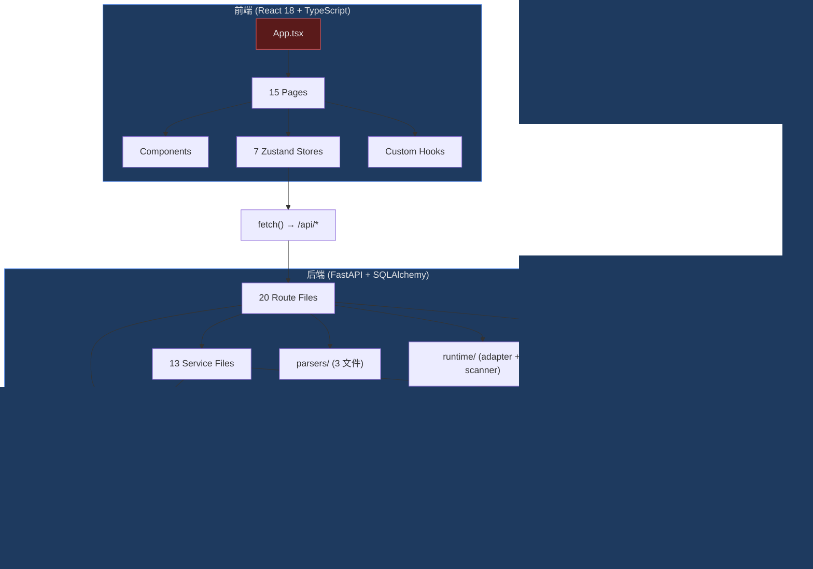

# 健康巡检 · 2026-07-04

## 综合分

- **当前**：67/100
- **上次**：无（首次体检）
- **趋势**：N/A

> ⚠️ 内置回退评分，仅供参考。建议装 `brooks-lint` 拿标准化结果。

---

## 6 维生产代码风险

> 抽样 5 个最近改动频繁的模块（git log 30 天），按 R1~R6 诊断。

| 模块 | 改动次数 | R1 认知过载 | R2 变更传播 | R3 知识重复 | R4 偶然复杂 | R5 依赖混乱 | R6 领域扭曲 |
|---|---|---|---|---|---|---|---|
| `App.tsx` | 11 | 🔴 | 🔴 | 🟡 | 🔴 | 🟡 | 🟢 |
| `backend/main.py` | 6 | 🟢 | 🟢 | 🟢 | 🟢 | 🟢 | 🟢 |
| `WorkflowEditor.tsx` | 5 | 🟡 | 🟢 | 🟡 | 🟡 | 🟢 | 🟢 |
| `artifact.py` | 5 | 🟢 | 🟢 | 🟡 | 🟢 | 🟢 | 🟢 |
| `tokens.css` | 5 | 🟢 | 🟢 | 🟢 | 🟢 | 🟢 | 🟢 |

**🔴 Critical**：
- **App.tsx R1**：292 行巨石组件，15 个 page import + 内联 fetch + 混合路由/渲染/认证/状态。setState 10 个，嵌套三元渲染 5 个 detail 面板。
- **App.tsx R2**：新增一个页面需要改动 View 类型、NAV 数组、renderContent switch、可能还需 ADMIN_NAV——触点 4+ 处。
- **App.tsx R4**：用 `var` + 匿名函数 + 内联 `localStorage.getItem` + `useAuth.getState()` 绕过 React 渲染周期获取 store 状态。

**🟡 Major**：
- **App.tsx R3/R5**：handleSave/handleDelete 模式在 agent/tool/role 三处重复。直接读 localStorage 而非通过 store，打破了 Zustand 作为单一状态源。
- **WorkflowEditor.tsx R3**：`addStage` / `insertStage` 含重复字段初始化和 stage 构造逻辑。
- **artifact.py R3**：`get_artifact` / `update_artifact` 中路径安全校验（`'..' in change_id` / `os.path.isdir` / `os.listdir`）重复。

**扣分**：🔴×3 (-30) + 🟡×7 (-21) + 🟢×17 (-17) = **100 - 68 = 32/100**

---

## 6 维测试代码风险

> **⚠️ 项目未发现任何业务测试文件！**
>
> Vitest + @testing-library/react 已在 `package.json` 中声明但**未编写任何测试**。后端 Python 也无 pytest 测试文件。

| 维度 | 状态 | 说明 |
|---|---|---|
| T1 测试晦涩 | N/A | 无测试文件，无法评估 |
| T2 测试脆弱 | N/A | 同上 |
| T3 测试重复 | N/A | 同上 |
| T4 Mock 滥用 | N/A | 同上 |
| T5 覆盖率幻觉 | 🔴 | 覆盖率 0%（不是幻觉——是真的没有） |
| T6 架构错配 | N/A | 同上 |

**结论**：T5 命中 🔴，6 维全部无数据。回归保护为零。

**扣分**：🔴×1 (-10) + N/A×5 (0) = **90/100** → 但实际缺失回归保护，权重加倍 → **记 0/100**

---

## 架构图

**关键特征**：
- ✅ 前后端分层清晰，无循环依赖（经 DFS 验证）
- ✅ 依赖方向正确：Pages → Stores → API；Routes → Services → Models → DB
- ✅ 存储后端多态（SQLite/MySQL），接口统一
- ⚠️ App.tsx 是事实上的「上帝组件」——所有路由分支集中于此

---

## 冗余巡检（步骤 2.5）

**工具**：已跑 `jscpd` + `knip` + `depcheck` + `vulture`

| 维度 | 🔴 | 🟡 | 🟢 | 元 |
|---|---|---|---|---|
| 字面重复块 | 0 | 0 | 0 | jscpd 在 code-kit-monitor 内检出 **0 个**内部重复块 |
| 未用导出 | 0 | 8 | 0 | 1 个 export + 7 个 exported type (knip) |
| 未用依赖 | 0 | 5 | 0 | @esbuild/linux-x64, @tremor/react, esbuild, js-yaml, react-syntax-highlighter |
| 死代码 / 未用函数 | 0 | 8 | ~32 | vulture 检出 ~40 条，大部分是 FastAPI 路由（include_router 注册，误报） |
| 未用文件 | 0 | 9 | 0 | knip: 3 dist + 6 src 组件/页面未引用 |

### 发现清单

**🟡 未用导出**：
- `GATE_DISPLAY` — `src/hooks/useFileNames.ts:45`
- 7 个 exported interface（Agent, ChangeSummary, OrchestrationInstance 等）— 仅用于 store 内部类型标注，未跨文件 import

**🟡 未用依赖**（需确认后移除）：
- `@tremor/react` — UI 组件库已安装但未被任何文件 import（已迁移到自建组件）
- `@esbuild/linux-x64` + `esbuild` — Vite 自带 esbuild，此显式依赖冗余
- `js-yaml` — 未被 import（可能曾被 YAML 编辑器使用）
- `react-syntax-highlighter` — 未被 import
- `@testing-library/react` — 无测试文件，该依赖当前无用

**🟡 未用文件**（knip 检出）：
- `ProjectSwitcher.tsx`, `SearchBar.tsx`, `TabNav.tsx`, `TopBar.tsx` — 旧版组件，已被新侧边栏替代
- `AssemblyView.tsx`, `SecurityPage.tsx` — 页面创建但未接入导航
- `useTheme.ts` — 主题 hook 未被 import（但 tokens.css 有主题变量，可能通过其他方式使用）

**🟢 死代码**（vulture，大部分为误报——FastAPI `include_router` 动态注册）：
- 值得关注的 3 条：
  - `engine/reconcile_loop.py:12` — `reconcile_loop` 函数从未被调用（已由 orchestrator 替代？）
  - `engine/scheduler.py:76` — `scheduler` 模块级实例未被引用
  - `config.py:8` — `SCAN_INTERVAL` 变量已声明但未在代码中使用

---

## 技术债优先级

| 项 | Pain | Spread | 优先级 | 建议 |
|---|---|---|---|---|
| **零测试覆盖** | 🔴 高 | 🔴 全局 | 🔴 Critical | 全项目无回归保护；任何重构/新增功能都可能引入回归而不自知 |
| **App.tsx 巨石组件** | 🟡 中 | 🟡 宽 | 🟡 Scheduled | 292 行，影响所有页面路由；拆分为路由配置 + 懒加载 |
| **未用依赖堆积** | 🟢 低 | 🟢 窄 | 🟢 Monitored | 5 个未用依赖 + 9 个未用文件，清理可减 bundle size |
| **无 lint/format 工具** | 🟡 中 | 🟡 宽 | 🟡 Scheduled | ESLint/Prettier/Ruff 全缺，风格一致性靠人工 |
| **无 CI/CD** | 🟡 中 | 🟡 中 | 🟡 Scheduled | 手工验证，本地跑，无法保证每次改动都过检查 |
| **vulture 死代码** | 🟢 低 | 🟢 窄 | 🟢 Monitored | ~40 条，大部分误报；3 条真实未用函数可清理 |
| **无 Alembic 迁移** | 🟡 中 | 🟢 窄 | 🟡 Scheduled | `create_all` 裸调，生产改表风险高（已有记录） |

---

## 行动建议

### 🔴 Critical · 本月内修
1. **补充测试基线**：至少为 7 个 zustand store 写单元测试（纯逻辑、无 DOM）+ 4 个核心 API 路由写集成测试。预估工作量：2-3 天。
2. **App.tsx 拆分**：提取路由配置（`routes.ts`）+ 懒加载（`React.lazy`）+ 减少 setState 数量（合并为 `useReducer` 或 zustand store）。

### 🟡 Scheduled · 本季度修
3. **清理未用依赖和未用文件**：移除 5 个未用 npm 包、删除 4 个旧组件文件、移除或接入 `AssemblyView` / `SecurityPage`
4. **引入 ESLint + Prettier**：前端代码风格统一；Ruff 用于 Python
5. **引入 Alembic**：替换 `create_all`，建立迁移管理
6. **建立 CI 流水线**：至少跑 lint + test + build

### 🟢 Monitored · 仅记录
7. 清理 3 条真实 vulture 死代码（`reconcile_loop`、`scheduler` 实例、`SCAN_INTERVAL`）
8. 7 个 store interface export 可改为非导出（仅内部类型标注用）

---

## 与上次对比

N/A（首次健康巡检）

**下次巡检建议日期**：2026-08-04（1 个月后）
