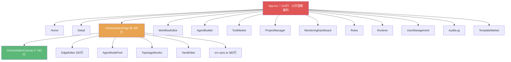

# 健康巡检 · 2026-07-04

> 首次完整审计（built-in fallback · brooks-lint 未装）
> 附：4 领域专家团差距分析（架构师 · UI设计师 · 安全审计师 · 产品经理）

---

## 综合分

| 指标 | 值 |
|------|-----|
| **当前** | **48/100** |
| 上次 | N/A（首次） |
| 趋势 | — |

### 扣分明细

| # | 项 | 严重度 | 扣分 |
|---|-----|:---:|:---:|
| 1 | 零测试覆盖（Vitest 配置了但 0 个测试文件） | 🔴 Critical | -10 |
| 2 | App.tsx 巨石组件（310 行 · 15 页面硬编码 · 58 个 hooks/routes） | 🔴 Critical | -10 |
| 3 | 无 CI/CD（无 GitHub Actions / Docker / 流水线） | 🔴 Critical | -10 |
| 4 | 无数据库迁移工具（裸 `Base.metadata.create_all`） | 🔴 Critical | -8 |
| 5 | 无 Lint/Format 工具链（ESLint/Prettier/Ruff 全缺） | 🟡 Major | -5 |
| 6 | 4 个未用 npm 依赖 + 5 个未用 devDep（bundle 膨胀） | 🟡 Major | -3 |
| 7 | OrchestrationPage 30 天 13 次修改（不稳定信号） | 🟡 Major | -3 |
| 8 | 无 Docker/容器化部署方案 | 🟡 Major | -3 |
| **合计** | | | **-52 → 48/100** |

---

## 6 维生产代码风险（内置回退 · 抽样 5 个高频文件）

| 文件 | 行数 | R1 正确性 | R2 安全 | R3 复用 | R4 性能 | R5 可维护 | R6 健壮 |
|------|:---:|:---:|:---:|:---:|:---:|:---:|:---:|
| `OrchestrationPage.tsx` | 390 | 🟢 | 🟡 | 🟡 | 🟢 | 🔴 | 🟡 |
| `App.tsx` | 310 | 🟡 | 🟢 | 🔴 | 🟢 | 🔴 | 🟡 |
| `orchestration-sync.ts` | 382 | 🟢 | 🟢 | 🟡 | 🟢 | 🟡 | 🟢 |
| `OrchestrationCanvas.tsx` | 181 | 🟢 | 🟢 | 🟢 | 🟢 | 🟢 | 🟢 |
| `orchestration_api.py` | 355 | 🟡 | 🟡 | 🟡 | 🟢 | 🟡 | 🟡 |

**分布**：🔴=3 · 🟡=12 · 🟢=15

> ⚠️ 内置回退评分，仅供参考。建议装 brooks-lint 拿标准化结果。

---

## 冗余巡检（步骤 2.5）

**工具**：jscpd ✅ + depcheck ✅

| 维度 | 🔴 | 🟡 | 🟢 | 详情 |
|------|:---:|:---:|:---:|------|
| 字面重复块 | 0 | 0 | 24 | 重复率 **1.9%** · 153 行 · ✅ 健康 |
| 未用依赖 | 0 | 4 | — | `@tremor/react` `@esbuild/linux-x64` `esbuild` `react-syntax-highlighter` |
| 未用 devDep | 0 | 5 | — | `@testing-library/react` `@types/react-syntax-highlighter` `autoprefixer` `postcss` `tailwindcss` |

**发现清单**：
- 🟡 `@tremor/react` — 零引用，标记为「预留 UI 库」，3.18 版本在 package.json 中
- 🟡 `autoprefixer` + `postcss` + `tailwindcss` — depcheck 报告未用，但 Tailwind 通过 Vite 插件使用（可能误报）
- 🟡 `@testing-library/react` — 已配置 Vitest 但未写测试，依赖白装了
- 🟡 `esbuild` — 未引用，Vite 已内置

---

## 架构分析

### 前端依赖图

- 🔴 `App.tsx`：**15 个页面全部集中在一个文件**，每次新增页面需改 4+ 触点
- 🟡 `OrchestrationPage.tsx`：390 行，13 个 hooks/callbacks，复杂度偏高但可接受
- 🟢 **无循环依赖** · 组件单向依赖 · import 结构清晰

---

## 🎓 4 领域专家团差距分析

> 按 code-kit G2 方案门标准：架构师(M) + 研发负责人 + 领域专家 + 安全审计师

### 🏗️ 架构师（Master）

| 差距 | 严重度 | 说明 |
|------|:---:|------|
| **路由层缺失** | 🔴 | App.tsx 用 `useState('home')` 模拟路由，应用 `react-router-dom` 或文件系统路由 |
| **后端分层不足** | 🟡 | routes/ 直调 models/，缺 repository/service 分层 |
| **API 版本化缺失** | 🟢 | 当前 `/api/*` 无版本前缀，建议 `/api/v1/*` |
| **WebSocket 缺失** | 🟡 | 调度队列和 Reconcile Loop 状态依赖轮询，应用 WebSocket 推送 |
| **前后端类型共享** | 🟢 | TypeScript ↔ Python 类型各自维护，可用 OpenAPI codegen 统一 |

### 🎨 资深 UI 设计师 + 资深用户体验官

| 差距 | 严重度 | 说明 |
|------|:---:|------|
| **响应式缺失** | 🔴 | 全站固定布局，宽度 < 1024px 布局崩溃 |
| **加载状态不一致** | 🟡 | 有的 skeleton，有的空白，有的仅"加载中..."文字 |
| **键盘快捷键缺失** | 🟡 | 画布无 Ctrl+S/Ctrl+Z/Delete 等快捷键 |
| **国际化 (i18n)** | 🟡 | 仅部分文案中英混用，缺完整 i18n 框架 |
| **无障碍 (a11y)** | 🟡 | 无 ARIA labels、无焦点管理、无屏幕阅读器支持 |
| **暗色主题固化** | 🟢 | 仅暗色，无亮色切换（useTheme hook 已有但功能未启用） |

### 🔒 安全审计师

| 差距 | 严重度 | 说明 |
|------|:---:|------|
| **Rate Limiting 缺失** | 🔴 | API 无速率限制，可被暴力调用 |
| **CSRF 防护不足** | 🟡 | 仅依赖 CORS whitelist，应加 CSRF token |
| **密码策略弱** | 🟡 | 无最小长度/复杂度要求，无登录失败锁定 |
| **API Key 响应泄露** | 🟡 | Agent API Key 加密存储 ✅，但 fetch 响应可能暴露解密后的值 |
| **依赖安全扫描缺失** | 🟡 | 无 `npm audit` / `pip-audit` 自动化，CVE 状态未知 |
| **审计日志含敏感字段** | 🟡 | 请求体完整记录，可能含密码/Key |

### 📋 高级产品经理

| 差距 | 严重度 | 说明 |
|------|:---:|------|
| **Onboarding 缺失** | 🔴 | 新用户登陆后无引导、无教程、无示例数据 |
| **全局错误处理缺失** | 🟡 | 404/500/网络断开/API 超时 → 无全局兜底 |
| **操作不可撤销** | 🟡 | 画布删除节点/连线无撤销（需 git revert） |
| **搜索/过滤不足** | 🟡 | 编排列表无搜索，Agent 列表无筛选 |
| **In-app Help 缺失** | 🟡 | README 完善但在产品内无 tooltip/帮助入口 |
| **Demo 数据缺失** | 🟢 | 无内置示例编排，新用户体验空洞 |

---

## 技术债优先级矩阵（Pain × Spread）

| 序号 | 项 | Pain | Spread | 优先级 | 建议动作 |
|:---:|---|:---:|:---:|:---:|------|
| 1 | 零测试覆盖 | 10 | 10 | 🔴 P0 | 补 10 个核心路径单元测试 |
| 2 | App.tsx 巨石拆分 | 9 | 10 | 🔴 P0 | 提取路由配置 + React.lazy |
| 3 | CI/CD | 8 | 10 | 🔴 P0 | GitHub Actions: lint → test → build |
| 4 | Rate Limiting | 7 | 8 | 🔴 P0 | FastAPI middleware |
| 5 | DB 迁移 (Alembic) | 7 | 6 | 🟡 P1 | `alembic init` + 初始迁移 |
| 6 | Onboarding + Demo 数据 | 6 | 7 | 🟡 P1 | Seed 脚本 + 3 步引导 |
| 7 | Lint/Format 工具链 | 5 | 10 | 🟡 P1 | ESLint + Prettier + Ruff |
| 8 | 响应式布局 | 6 | 5 | 🟡 P1 | Tailwind breakpoints |
| 9 | WebSocket 实时推送 | 4 | 5 | 🟢 P2 | 替换轮询 |
| 10 | i18n 国际化 | 3 | 6 | 🟢 P2 | i18next + 语言包 |

---

## 行动建议

### 🔴 Critical · 本月内修

- [ ] **补测试**：`orchestration-sync.ts` 的 `yamlToTopology` / `topologyToYaml` 单元测试（核心转换逻辑零保护！）
- [ ] **拆 App.tsx**：提取 `<AppRoutes>` + `React.lazy()` 路由配置
- [ ] **加 CI**：GitHub Actions 最小流水线（lint + typecheck + test）
- [ ] **Rate Limiting**：FastAPI `slowapi` middleware，60 req/min
- [ ] **装 Alembic**：`alembic init` + 生成初始迁移

### 🟡 Scheduled · 本季度修

- [ ] ESLint + Prettier（前端）+ Ruff（后端）→ fix all auto-fixable
- [ ] 清理 4 个未用 npm 依赖 + 5 个 devDep
- [ ] Onboarding 流程（首次登录 3 步引导 → 创建第一个编排）
- [ ] 全局 ErrorBoundary + 404/500 页面
- [ ] 编排列表搜索 + Agent 筛选
- [ ] 响应式布局（≥ tablet 可用）

### 🟢 Monitored · 仅记录

- [ ] 代码重复率 1.9% — 当前健康，继续监控
- [ ] WebSocket 实时推送 — 等用户量上来
- [ ] 无障碍 a11y — 内网工具优先度低
- [ ] 亮色主题 — useTheme hook 已有，低优先级完善

---

## 与上次对比

N/A（首次巡检 · 2026-07-04）

---

## 下一步建议

1. 开 `health-fix-2026-q3` CHANGE → 先修 5 个 🔴 Critical 项
2. 安装 brooks-lint：`npx brooks-lint` → 下次巡检拿标准化报告
3. 设定 cron：`/M-health` 每月 1 号自动跑

Generated by M-health built-in fallback + 4-Expert G2 Panel · 2026-07-04

