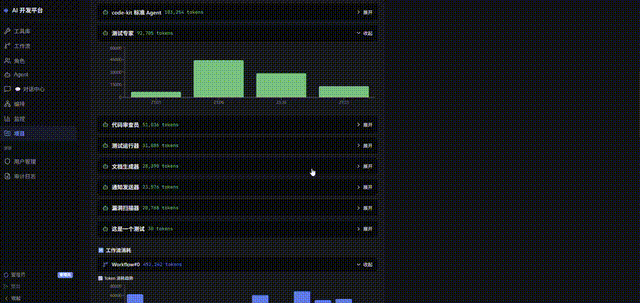

# AgentFlow

> **智能化 Agent 编排与监控平台** — 借鉴 K8s 架构思想，统一管理 AI Agent 的调度、路由、伸缩与健康监控

---

## 项目背景

### 为什么会有这个项目

2025 年以来，AI Agent 从概念走向工程化落地。Claude Code、Cursor、Copilot 让单个 Agent 变得好用，但**多 Agent 协同管控**仍然是一片荒地：

| 痛点 | 现状 |
|---|---|
| Agent 挂了 | 用户不知道，半小时后才发现任务没跑完 |
| 同语义多个 Agent | 手动指定用哪个，一个忙死另一个闲死 |
| Agent 之间 | 没有隔离、没有路由、没有负载均衡 |
| 弹性伸缩 | 流量高峰全靠手动加 Agent |
| 新 Agent 代替旧 Agent | 上下文全丢，从零开始 |

### 为什么借鉴 K8s

Kubernetes 用十年时间证明了**分布式系统管控**的最佳实践：Namespace（隔离）、Deployment（副本管理）、Service（自动路由+负载均衡）、Ingress（统一入口）、HPA（弹性伸缩）、etcd（状态一致性）。这些不是容器专属——**它们是分布式系统管控的通用范式**。Agent 也是分布式实体，天然适用。

### AgentFlow 的答案

```
K8s 管 Pod     → AgentFlow 管 Agent
K8s Namespace  → AgentFlow 隔离域
K8s Deployment → AgentFlow Capability 组
K8s Service    → AgentFlow 自动路由
K8s HPA        → AgentFlow 渐进式扩容
K8s etcd       → AgentFlow 记忆系统
```

---

## 竞品分析

### 市面上产品的共同缺点

Dify、Langflow、n8n、Coze 都专注于**单个 Agent 或单条工作流的编排**——把 Agent 当成孤立的工具来管理。

它们的共同盲区：

| 缺失的能力 | 实际问题 |
|---|---|
| **无隔离机制** | 所有 Agent 全平台可见，开发环境和生产环境的 Agent 混在一起 |
| **无自动路由** | 同语义 3 个 Agent，用户必须手动指定用哪一个 |
| **无负载均衡** | Agent A 排队 10 个任务，Agent B 完全空闲——用户不知道 |
| **无弹性伸缩** | 高峰期只能手动加 Agent，加完还要手动配 API key |
| **无自愈能力** | Agent 挂了就是挂了，不会自动重启或切换 |
| **无记忆共享** | 新 Agent 启动完全空白，不知道前一个 Agent 审查过什么 |
| **监控粒度粗** | 只有 Token 统计，没有主机/网络/模型 API 限流监控 |

### 能力对比

| 能力 | Dify | Langflow | n8n | Coze | **AgentFlow** |
|---|---|---|---|---|---|
| 可视化编排 | ✅ | ✅ | ✅ | ✅ | ✅ |
| 连线策略 | 2-3 种 | 3-4 种 | 3-4 种 | 基础 | **13 种** |
| 多 Agent 隔离（Namespace） | ❌ | ❌ | ❌ | ❌ | **✅** |
| 自动路由（Service） | ❌ | ❌ | ❌ | ❌ | **✅** |
| 负载均衡 | ❌ | ❌ | ❌ | ❌ | **✅** |
| 弹性扩容（HPA） | ❌ | ❌ | ❌ | ❌ | **✅** |
| 记忆系统（etcd） | 对话记忆 | ❌ | ❌ | 对话记忆 | **✅ 域级共享** |
| 自愈修复 | ❌ | ❌ | ❌ | ❌ | **✅ 三级** |
| 全栈监控（4 层） | Token | ❌ | ❌ | Token | **✅** |
| Reconcile Loop | ❌ | ❌ | ❌ | ❌ | **✅** |
| 开源 | ✅ | ✅ | ✅ | ❌ | ✅ |

---

## 能做到什么程度

```
现在 ✅                      下一阶段 📋                    远景 🔮
─────────────────────────────────────────────────────────────────
隔离域 + Capability 分组      域内自动服务发现            多集群联邦
自动路由 + Least Connection   跨域公开路由                智能语义路由 (NLP)
渐进式扩容                    多维负载均衡                自动模型切换
三层递进 UI                   全栈监控面板                AI 驱动的调度策略
网关统一入口                  弹性缩容                    自建 Agent 市场
Reconcile 自愈                多 Agent 联邦              跨平台 Agent 协议
```

---

## 核心优势

1. **K8s 管控思想落地**：不是简单编排，是命名空间隔离、自动路由、弹性伸缩的完整 Agent 集群管控
2. **开箱即用的自愈能力**：Agent 挂了自动检测 → Reconcile Loop 自动修复，三级策略（safe/caution/dangerous）
3. **工业暗色递进 UI**：K8s Dashboard 风格——概览 → 域 → Agent 组 → 单 Agent，层层深入，数据密度优先
4. **零外部依赖**：SQLite 实现 etcd 等价功能，不引入 Redis/etcd/消息队列
5. **通用 Agent 管控**：不绑定任何流程框架，你自己的开发流程照常跑

---

## 功能总览

### 🤖 Agent 编排（核心）
- YAML ↔ 拓扑画布双向同步
- 13 种连线策略（sequential/pipeline/parallel/fan-out/fan-in 等）
- Reconcile Loop 声明式调度
- 跨 Agent 调用链追踪 + 拓扑级实时监控
- 编排模板市场 + 参数化部署

### 🏗️ Agent 管控平台（K8s 架构思想）— 新增
- **隔离域**：域内 Agent 自动发现，跨域默认隔离
- **Capability 分组**：同能力 Agent 自动成组，显示健康/总数
- **自动路由**：标签匹配 + Least Connection 负载均衡
- **网关**：统一入口，按 capability 标签路由
- **渐进式扩容**：排队超阈值 → 自动创建副本
- **记忆系统**：新 Agent 启动自动加载同域上下文
- **全栈监控**：主机(CPU/内存/磁盘) + Agent(Token/耗时) + 模型(Rate Limit)
- **自愈修复**：safe/caution/dangerous 三级自动修复

### 💬 对话中心
- 侧边栏独立入口，类 ChatGPT 交互
- 飞书/钉钉渠道消息中继 + OAuth 扫码接入
- Mock 模式支持本地开发调试

### 🧩 工具库 + 工作流
- Plugin / Skill / MCP 管理
- 文本声明 + 可视化 DAG 两种工作流定义方式
- 模板市场

### 📊 项目管理
- 需求文档输入 → 绑定 Agent + 工作流 → 执行 → 监控

### 🔒 安全
- RBAC 权限 + 凭证加密存储 + 全操作审计日志

---

## 演示

| 功能 | 说明 |
|---|---|
| 🎬 三层递进 UI | 管控面 → 隔离域 → Capability 组 → Agent 列表 |
| 🎬 自动路由 | 同 capability 任务自动分发给最空闲 Agent |
| 🎬 渐进式扩容 | 排队超阈值 → 自动创建副本 |
| 🎬 记忆加载 | 新 Agent 启动自动加载同域上下文 |

---

## 项目结构

```
AgentFlow/
├── code-kit-monitor/            # Web 监控面板
│   ├── backend/                 # FastAPI 后端（105+ .py）
│   │   ├── routes/              # API 路由（agent/workflow/tool/orchestration/domain/gateway...）
│   │   ├── models/              # ORM 模型（20 个表）
│   │   ├── services/            # 业务服务（probe/scheduler/routing/gateway/host_metrics...）
│   │   ├── engine/              # 编排引擎（Reconcile Loop/Scheduler）
│   │   └── storage/             # 存储抽象
│   └── frontend/                # React 前端（95+ ts/tsx）
│       ├── src/pages/           # 页面（AgentControlPlane/MonitoringDashboard...）
│       ├── src/components/      # 组件（DomainTreeTab/CapabilityGroupRow...）
│       ├── src/stores/          # Zustand Store（domains/controlPlane...）
│       └── src/styles/          # Design tokens（--cp-* 变量）
├── .specs/                      # Change 产物
│   ├── agent-control-plane/     # 管控面 + 探针采集
│   ├── agent-domains/           # 隔离域 + 三层树
│   ├── k8s-three/               # 路由 + 网关 + 伸缩
│   └── k8s-final/               # 记忆 + 监控 + 域隔离
├── STATE.md                     # 跨会话状态
├── CLAUDE.md                    # Claude Code 规则
└── README.md
```

---

## 环境要求

| 组件 | 要求 |
|---|---|
| Python | 3.10+ |
| Node.js | 18+ |
| 操作系统 | Linux / macOS / Windows |
| 浏览器 | Chrome 90+ / Firefox 90+ / Edge 90+ |

---

## 快速开始

```bash
# 1. 后端（零配置启动，首次自动创建 SQLite）
cd code-kit-monitor/backend
pip install -r requirements.txt
ENCRYPTION_KEY="your-32-byte-key" uvicorn main:app --host 0.0.0.0 --port 8000 --reload
# → http://127.0.0.1:8000
# → API 文档: http://127.0.0.1:8000/docs

# 2. 前端（新终端）
cd code-kit-monitor/frontend
npm install
npx vite --host 0.0.0.0 --port 5173
# → http://127.0.0.1:5173

# 3. 登录
# 默认管理员: admin / 123456
# 普通用户: testuser / 123
```

**启动后**：左侧「Agent 管控」→ 隔离域 → 展开默认域 → 查看按 Capability 分组的 Agent。

---

## API 端点（部分）

| 模块 | 端点 | 说明 |
|---|---|---|
| 管控面 | `GET /api/control-plane/probes` | Agent 探针状态 |
| 隔离域 | `GET /api/domains` | 域列表 |
| 路由 | `POST /api/domains/{id}/route` | 域内自动路由 |
| 网关 | `POST /api/gateway/route` | 跨域统一路由 |
| 伸缩 | `POST /api/domains/{id}/scale` | 渐进式扩容 |
| 监控 | `GET /api/metrics/host` | 主机资源 |
| 记忆 | `POST /api/agents/{id}/load-memory` | 加载同域记忆 |
| Agent | `GET/POST /api/agents` | Agent CRUD |

---

## License

Private. All rights reserved.
